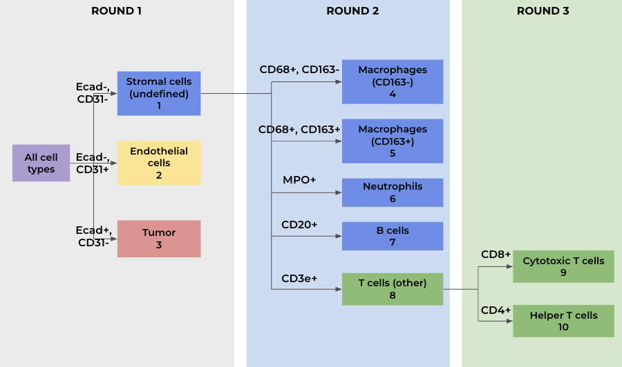
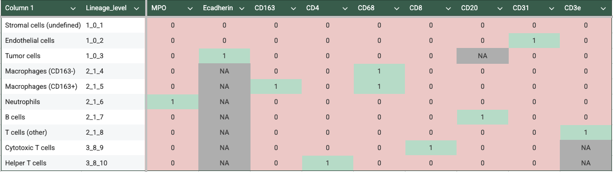
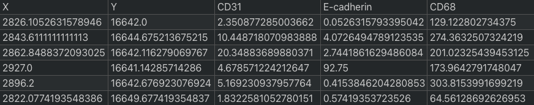
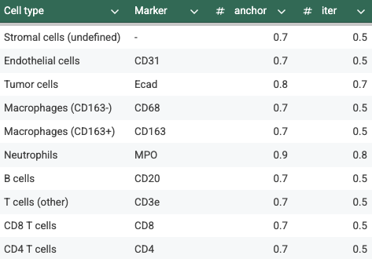
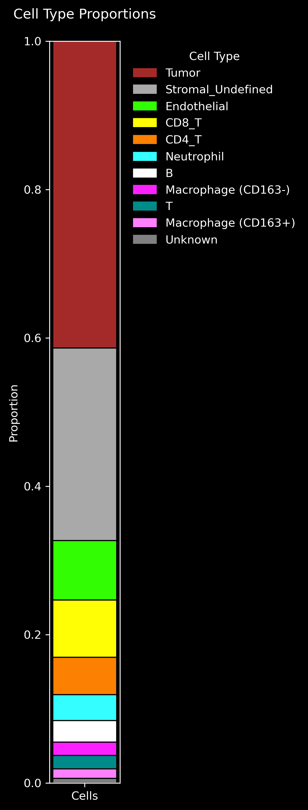
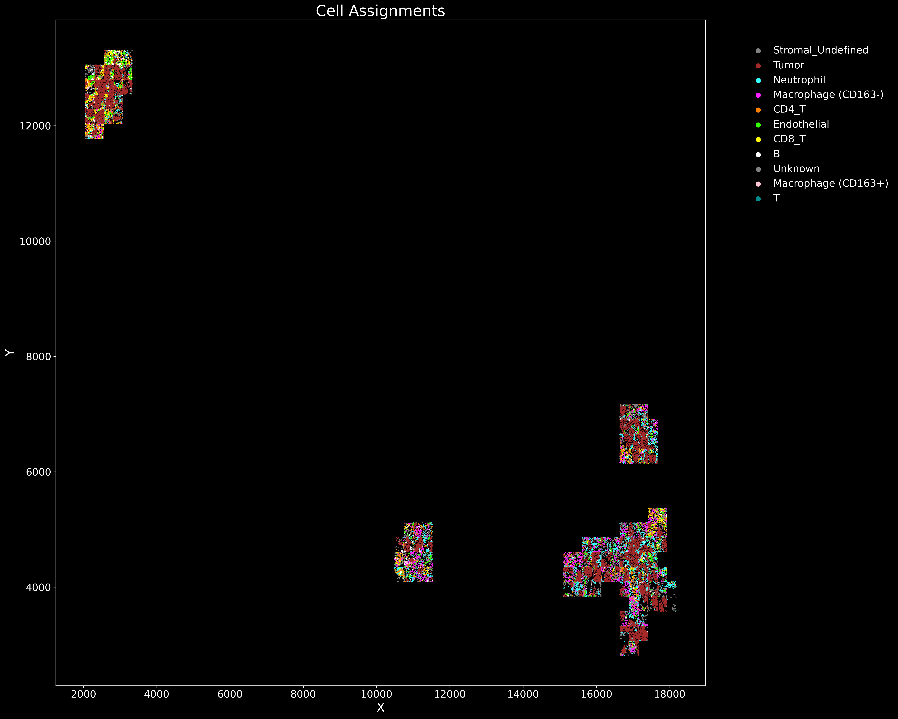

# Guide to CELESTA

All credit for CELESTA goes to the Plevritis Lab. For more details, see https://github.com/plevritis-lab/CELESTA.

## Testing `celesta` environment

See `README_celesta_env.md` for details on setting up and activating the `celesta` conda environment.

You can test this with:

```bash
source bash_scripts/set_up_conda.sh
conda activate celesta
```

And in R,
```R
library(CELESTA)
```

## CELESTA inputs

### 1. Prior marker info

Matrix of cell types (rows) by name, lineage level, and expected expression probability per marker (columns). Sometimes it is easier to visualize as a flowchart:



This is how it translates into tabular form:


    
### 2. Imaging data

Contains X/Y coordinates and raw expression levels per marker. Each row should correspond to an individual cell.



## Running CELESTA step-by-step 

### 1. Clone repository

Clone the `CC_codeximaging` repo and navigate to `bash_scripts`. Note that whenever you run a bash script, there are arguments you will need to edit according to your needs.

### 2. Prepare inputs

Refer to https://github.com/plevritis-lab/CELESTA for more detailed information on preparing inputs.

* **Prior marker info**
    
    Prepare in a separate spreadsheet and save as CSV ([example spreadsheet](https://docs.google.com/spreadsheets/d/1xc_mcczZ0B0EAhWt6SpMEdjmpPlIWInAd9OLzNKNgkI/edit?usp=sharing)).

    Under each marker column, enter 0 for low expression probability, 1 for high expression probability, and NA if the marker is irrelevant for the given cell type.

* **Imaging data**

    Run this script:
    ```
    celesta_imaging_data_prep.sh
    ```
    *Note: To edit paths and other specifics, you will need to edit `src/celesta/celesta_imaging_data_prep.py`. Imaging data CSV files will be outputted into the specified `imaging_data_path`.* 

### 3. Create CELESTA object

*Outputs a CELESTA RDS object along with a CSV file of marker expression probability.*

First open this script:

```
celesta_create_obj.sh
```

You will need to edit these arguments:

```bash
--project_title "cervical_${sample}_raw_arcsinh" \
--prior_marker_info "/path/to/prior_marker_info.csv" \
--imaging_data "path/to/imaging_data_${sample}_raw.csv" \
--results_dir "path/to/celesta_results" \
--transform_type 1
```

* `project_title:` This will be the name of the subfolder containing all results, as well as the prefix for filenames.
* `prior_marker_info`: Path to prior marker info CSV.
* `imaging_data`: Path to imaging data CSV.
* `results_dir`: Path to directory where you want *all* of your CELESTA results to go. The script will automatically create a subfolder named after `project_title` here.

After editing arguments, run the script for all specified samples in parallel using:

```
submit_samples_array.sh
```

In the script above, make sure to set:

```bash
script_name="celesta_assign_cells"
```

Update the sample list and node configuration as needed.


### 4. Plot expression probability

*Outputs expression probability plots for each sample that will help you choose thresholds when assigning cell types.*

First open this script:

```
celesta_plot_exp_prob.sh
```

You will need to edit these arguments:

```bash
--project_title "cervical_${sample}_raw_arcsinh" \
--results_dir "path/to/celesta_results"
```

* `project_title:` Use same value as in `celesta_create_obj.sh`. This should be the name of the subfolder containing all results.
* `results_dir`: Use same value as in `celesta_create_obj.sh`. This should be the parent directory of the `project_title` subdir.

After editing arguments, run the script for all specified samples in parallel using:

```
submit_samples_array.sh
```

In the script above, make sure to set:

```bash
script_name="celesta_plot_exp_prob"
```

Update the sample list and node configuration as needed.

Example plot:


### 5. Assign cell types
*Outputs an updated CELESTA RDS object with cell type assignments along with a CSV file. Output filenames will contain the full lists of `high_anchor` and `high_iter` thresholds, so results from every unique run will be saved.*

First open this script:
```
celesta_assign_cells.sh
```

You will need to edit these arguments:

```bash
--project_title "cervical_${sample}_raw_arcsinh" \
--results_dir "path/to/celesta_results" \
--high_anchor 0.7 0.7 0.9 0.7 0.7 0.7 0.7 0.7 0.7 0.7 0.7 0.7 0.7 0.7 \
--high_iter 0.5 0.5 0.6 0.5 0.5 0.5 0.5 0.5 0.5 0.5 0.5 0.5 0.5 0.5 \
--low_anchor 0.9 0.9 0.9 0.9 0.9 0.9 0.9 0.9 0.9 0.9 0.9 0.9 0.9 0.9 \
--low_iter 1 1 1 1 1 1 1 1 1 1 1 1 1 1 
```

* `project_title:` Use same value as in `celesta_create_obj.sh`. This should be the name of the subfolder containing all results.
* `results_dir`: Use same value as in `celesta_create_obj.sh`. This should be the parent directory of the `project_title` subdir.
* `high_anchor`: Series of space-separated thresholds for high expression probability in anchor cells, in order of cell types listed in `prior_marker_info`. Can leave blank for CELESTA defaults (0.7 for all cell types).*
* `high_iter`: Same as above, but for iteration cells. Default is 0.5 for all cell types.*
* `low_anchor`: Same as above, but defines low expression probability for anchor cells. Default is 0.9 for all cell types.*
* `low_iter`: Same as above, but for iteration cells. Default is 1 for all cell types.*

After editing arguments, run the script for all specified samples in parallel using:

```
submit_samples_array.sh
```

In the script above, make sure to set:

```bash
script_name="celesta_assign_cells"
```

Update the sample list and node configuration as needed.

### *Note on choosing threhsolds
*CELESTA requires high and low marker expression probability thresholds for anchor and iteration cells. Default thresholds may be used at first, but tuning high thresholds is recommended. Low thresholds typically do not need to be tuned.*

For `high_anchor` and `high_iter`, you can use this [example spreadsheet](https://docs.google.com/spreadsheets/d/1xc_mcczZ0B0EAhWt6SpMEdjmpPlIWInAd9OLzNKNgkI/edit?usp=sharing) to edit thresholds and output them into the correct format for CELESTA. 



### 6. Plot results
*Generates stacked bar plots of cell type proportions and static/interactive spatial plots of cell type assignments for each `final_cell_type_assignment.csv` file generated by the previous step.*

First open these scripts:

```
celesta_plot_results.sh
celesta_plot_interactive_assignments.sh
```

For both scripts, you will need to edit these arguments:

```bash
--project_title "cervical_${sample}_raw_arcsinh" \
--results_dir "/gpfs/data/proteomics/home/yb2612/results/celesta"
```

* `project_title:` Use same value as in `celesta_create_obj.sh`. This should be the name of the subfolder containing all results.
* `results_dir`: Use same value as in `celesta_create_obj.sh`. This should be the parent directory of the `project_title` subdir.

Example plots: 

<p>
  
  
</p>

### 7. Upload results to OMERO.
```
celesta_to_omero_prep.sh
```

```
main_celltype_tables.sh
```

All CELESTA results should be uploaded to OMERO (https://omero.nyumc.org/) after completion. This will allow you to use the PathViewer tool to overlay assigned cell types onto the CODEX image and visually evaluate how well they overlap with marker expression. To upload results, follow these steps:

1. Open [notebooks/celesta_data_prep_cervical.ipynb](https://github.com/lp2700/CC_codeximaging/blob/feature/celesta_phenotyping/notebooks/celesta_data_prep_cervical.ipynb) and run the code blocks under "Upload cell types to OMERO". Adjust file names and paths as necessary.
2. Open `config/config_cellsegmentation.yaml` and set `celltypes_table_name` to the file name of the cell types table you exported in the previous step.
3. Create a `.env` file in `bash_scripts` directory. Enter your PASSWORD and KERBEROSID.
4. Run `main_celltype_tables.sh`.
5. The tables should now appear on OMERO.

## Running full native CELESTA pipeline (not recommended)
*Note: While this is the simplest option, it is not recommended. It entails building the object from scratch, and only one set of thresholds can be tested at a time. Plots outputted by CELESTA are also not easily customizable.*

```
celesta_full_pipeline.sh
```

This creates a CELESTA object, assigns cells, plots expression probability, and plots cell assignments using built-in CELESTA functions. 

You will need to edit these arguments:

```bash
--project_title "cervical_10103_raw_arcsinh" \
--prior_marker_info "/gpfs/data/proteomics/home/yb2612/data/celesta/cervical/prior_marker_info_cervical.csv" \
--imaging_data "/gpfs/data/proteomics/home/yb2612/data/celesta/cervical/imaging_data_10103_raw.csv" \
--results_dir "/gpfs/data/proteomics/home/yb2612/results/celesta" \
--transform_type 1 \
--high_anchor 0.7 0.7 0.9 0.7 0.7 0.7 0.7 0.7 0.7 0.7 0.7 0.7 0.7 0.7 \
--high_iter 0.5 0.5 0.6 0.5 0.5 0.5 0.5 0.5 0.5 0.5 0.5 0.5 0.5 0.5 \
--low_anchor 0.9 0.9 0.9 0.9 0.9 0.9 0.9 0.9 0.9 0.9 0.9 0.9 0.9 0.9 \
--low_iter 1 1 1 1 1 1 1 1 1 1 1 1 1 1 
```

* `project_title:` This will be the name of the subfolder containing all results, as well as the prefix for filenames.
* `prior_marker_info`: Path to prior marker info CSV.
* `imaging_data`: Path to imaging data CSV.
* `results_dir`: Path to directory where you want *all* of your CELESTA results to go. The script will automatically create a subfolder named after `project_title` here.
* `high_anchor`: Series of space-separated expression thresholds for anchor cells, in order of cell types listed in `prior_marker_info`. Can leave blank for CELESTA defaults (0.7 for all cell types).
* `high_iter`: Series of space-separated expression thresholds for iteration cells, in order of cell types listed in `prior_marker_info`. Can leave blank for CELESTA defaults (0.5 for all cell types).
* `low_anchor`: Series of space-separated expression thresholds for anchor cells, in order of cell types listed in `prior_marker_info`. Can leave blank for CELESTA defaults (0.9 for all cell types).
* `low_iter`: Series of space-separated expression thresholds for anchor cells, in order of cell types listed in `prior_marker_info`. Can leave blank for CELESTA defaults (1 for all cell types).

## CELESTA outputs

Outputs will be saved to `results_dir/project_title/` as specified in the bash script.

1. `celesta_full_pipeline.sh` outputs:
    * CELESTA object without cell type assignments (RDS)
    * CELESTA object with cell type assignments (RDS)
    * Final cell assignments (CSV)
    * Cell assignment plot (PNG)
    * Marker expression probability plots (PNG)

2. `celesta_create_obj.sh` outputs:
    * CELESTA object without cell type assignments (RDS)
    * Marker expression probability (CSV)

3. `celesta_create_obj.sh` outputs:
    * Marker expression probability plots (PNG)

4. `celesta_assign_cells.sh` outputs:
    * CELESTA object with cell type assignments (RDS)
    * Final cell assignments (CSV)

5. `celesta_plot_results.sh` outputs:
    * Cell type proportions stacked bar plot for each `final_cell_type_assignment.csv` file (PNG)
    * Spatial plot of cell type assignments for each `final_cell_type_assignment.csv` file (PNG)

6. `celesta_plot_interactive_assignments.sh` outputs:
    * Interactive spatial plot of cell type assignments for each `final_cell_type_assignment.csv` file (HTML)

## Evaluating CELESTA performance

### Computational evaluation with Jupyter notebook
You can also evaluate CELESTA results using `notebooks/celesta_evaluate_results_cervical.ipynb`. This contains the following code blocks:

* **arcsinh_exp_prob:** Plots expression probability, in the same way that `celesta_plot_exp_prob.sh` does. This is so you can see all plots at once, which can help when selecting thresholds. 

* **Violin plots and Spatial plots:** For visual comparison of raw biomarker means and marker expression probability.

* **Threshold search (mean of conf matrix diagonal):** If you have ground truth labels, you can evaluate threshold performance using the mean of the diagonal of the confusion matrix. This is best for making sure CELESTA has balanced performance across all classes. Make sure you have run `celesta_assign_cells.sh` with all of the different thresholds you want to test. 

* **Best thresholds - full evaluation.** This takes results from the chosen best thresholds and displays the following:

    * Plots showing accuracy for selected cell types
    * Classification report and graph of precision/recall/f1-score per cell type and overall
    * Confusion matrix
    * Plot of cell type proportions from  manual pipeline vs. CELESTA
    * Spatial plot of cell type assignments

There is also a notebook `notebooks/celesta_broad_vs_detailed_cervical.ipynb` to compare results from broad cell types to detailed cell types.

# Notes

1. I first ran CELESTA on two endometrial cancer samples: 1T (22k cells) and 3P (1M cells). 
    * For the imaging data, I used raw biomarker means with no further transformation. 
    * Both samples had manual annotations, which were treated as ground truth labels. 
    * I tested multiple thresholds and used `notebooks/celesta_evaluate_results_cervical.ipynb` to select the best thresholds (see "Evaluating CELESTA performance" section above).
3. I then ran the full CELESTA pipeline on all 14 cervical cancer samples. 
    * For the imaging data, I used raw biomarker means with CELESTA's built-in arcsinh transformation. 
    * Initially, default thresholds were used for all samples.
    * Thresholds will be tuned as described in the "Evaluating CELESTA performance" section above.
    * Three samples (10103, 34933, and 29973) had manual annotations, which were used for evaluation.
