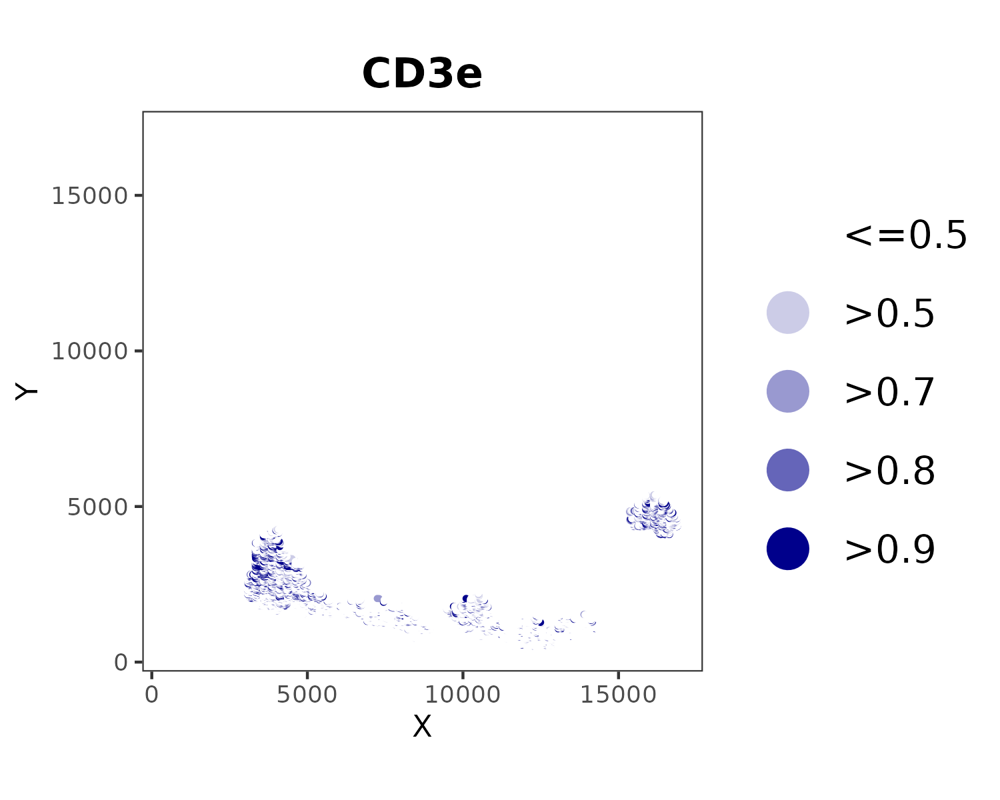
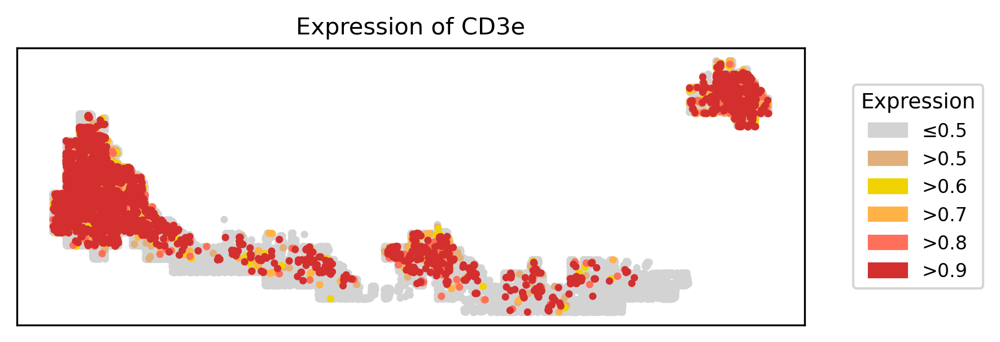

# Guide to CELESTA

All credit goes to the Plevritis Lab for this wonderful library! For more details, see https://github.com/plevritis-lab/CELESTA.

## Testing `celesta` environment

See `README_celesta_env.md` for details on activating/setting up the `celesta` conda environment. Hopefully the one I've created on the shared lab miniconda works for everyone.

You can test this with:

```bash
source bash_scripts/set_up_conda.sh
conda activate celesta
```

And in R,
```R
library(CELESTA)
```

## Preparing CELESTA inputs

CELESTA requires two main inputs in CSV format: **prior marker information** ([example spreadsheet](https://docs.google.com/spreadsheets/d/1xc_mcczZ0B0EAhWt6SpMEdjmpPlIWInAd9OLzNKNgkI/edit?usp=sharing)) and **imaging data** (`notebooks/celesta_data_prep_cervical.ipynb`). 

1. **Prior marker info (CSV):** Contains cell type name, lineage levels, and marker expression probability 0/1 per cell type. Each row should correspond to a cell type.
    
    Sometimes it is easier to visualize it as a flowchart first:

    

    This is how it translates into tabular form:

    
    
2. **Imaging data (CSV):** Contains X/Y coordinates and raw expression levels per marker. Each row should correspond to an individual cell.

    

Aside from these, you will also need to input high and low marker expression probability thresholds for anchor and iteration cells. Low thresholds can be set to 1 for all cells, but high thresholds need to be tuned. 

This [example spreadsheet](https://docs.google.com/spreadsheets/d/1xc_mcczZ0B0EAhWt6SpMEdjmpPlIWInAd9OLzNKNgkI/edit?usp=sharing) also contains `high_thresholds` sheets where you can easily edit thresholds per cell type and output it into a format that CELESTA will accept:


## Running CELESTA step-by-step 

*Note: This gives you more control over each step. It also allows you to test a bunch of thresholds on an existing CELESTA object rather than having to build the object from scratch every time.*

Clone the `CC_codeximaging` repo and navigate to `bash_scripts`. Note that whenever you run a bash script, there are arguments you will need to edit according to your needs.

### 1. Run `celesta_create_obj.sh` to create a CELESTA object.

This will also output a CSV file of marker expression probability.

You will need to edit these arguments:

```bash
--project_title "cervical_10103_raw_arcsinh" \
--prior_marker_info "/gpfs/data/proteomics/home/yb2612/data/celesta/cervical/prior_marker_info_cervical.csv" \
--imaging_data "/gpfs/data/proteomics/home/yb2612/data/celesta/cervical/imaging_data_10103_raw.csv" \
--results_dir "/gpfs/data/proteomics/home/yb2612/results/celesta" \
--transform_type 1
```

* `project_title:` This will be the name of the subfolder containing all results, as well as the prefix for filenames.
* `prior_marker_info`: Path to prior marker info CSV.
* `imaging_data`: Path to imaging data CSV.
* `results_dir`: Path to directory where you want *all* of your CELESTA results to go. The script will automatically create a subfolder named after `project_title` here.

### 2. Plot expression probability with `celesta_plot_exp_prob.sh`.

This will help you choose thresholds when assigning cell types.

You will need to edit these arguments:

```bash
--project_title "cervical_10103_raw_arcsinh" \
--results_dir "/gpfs/data/proteomics/home/yb2612/results/celesta"
```

* `project_title:` Use same value as in `celesta_create_obj.sh`. This should be the name of the subfolder containing all results.
* `results_dir`: Use same value as in `celesta_create_obj.sh`. This should be the parent directory of the `project_title` subdir.

I've made my own script to plot expression probability because I think it looks better than CELESTA's plots. Case in point:



*CELESTA's expression probability plot for CD3e in one of our samples. Notice that points are large and overlapping, making it hard to select an appropriate threshold.*



*Yumi's expression probability plot for the same marker and sample. The points are smaller with less overlap, and points with higher probability are plotted on top.*

### 3. Assign cell types with `celesta_assign_cells.sh`.

You will need to edit these arguments:

```bash
--project_title "cervical_10103_raw_arcsinh" \
--results_dir "/gpfs/data/proteomics/home/yb2612/results/celesta" \
--high_anchor 0.9 0.9 0.9 0.9 0.9 0.9 0.9 0.9 0.9 0.9 \
--high_iter 0.8 0.8 0.8 0.8 0.8 0.8 0.8 0.8 0.8 0.8 \
--low_anchor 1 1 1 1 1 1 1 1 1 1 \
--low_iter 1 1 1 1 1 1 1 1 1 1
```

* `project_title:` Use same value as in `celesta_create_obj.sh`. This should be the name of the subfolder containing all results.
* `results_dir`: Use same value as in `celesta_create_obj.sh`. This should be the parent directory of the `project_title` subdir.
* `high_anchor`: Series of space-separated thresholds for high expression probability in anchor cells, in order of cell types listed in `prior_marker_info`. Can leave blank for CELESTA defaults (0.7 for all cell types).
* `high_iter`: Same as above, but for iteration cells. Default is 0.5 for all cell types.
* `low_anchor`: Same as above, but defines low expression probability for anchor cells. Default is 0.9 for all cell types.
* `low_iter`: Same as above, but for iteration cells. Default is 1 for all cell types.

For `high_anchor` and `high_iter`, you can use this [example spreadsheet](https://docs.google.com/spreadsheets/d/1xc_mcczZ0B0EAhWt6SpMEdjmpPlIWInAd9OLzNKNgkI/edit?usp=sharing) to edit thresholds and output them into the correct format for CELESTA. You can use this script to test a bunch of different thresholds, and all results will be saved with a unique filename.

*Note: Output filenames will contain the full lists of `high_anchor` and `high_iter` thresholds. There is probably a better way to do this, but this is how it is for now.*

### 4. Plot results with `celesta_plot_results.sh` and `celesta_plot_interactive_assignments.sh`.

`celesta_plot_results.sh` generates a stacked bar plot of cell type proportions and a spatial plot of cell type assignments *for each* `final_cell_type_assignment.csv` file generated by the previous step. `celesta_plot_interactive_assignments.sh` generates interactive spatial plots of cell type assignments.

For both scripts, you will need to edit these arguments:

```bash
--project_title "cervical_10103_raw_arcsinh" \
--results_dir "/gpfs/data/proteomics/home/yb2612/results/celesta"
```

* `project_title:` Use same value as in `celesta_create_obj.sh`. This should be the name of the subfolder containing all results.
* `results_dir`: Use same value as in `celesta_create_obj.sh`. This should be the parent directory of the `project_title` subdir.

Example plots: 

<p>
  
  
</p>

## Running full CELESTA pipeline

This creates a CELESTA object, assigns cells, plots expression probability, and plots cell assignments using built-in CELESTA functions. 

*Note: While this is the simplest option, it isn't the fastest. It entails building the object from scratch, and only one set of thresholds can be tested at a time. Furthermore, the plots outputted by CELESTA don't always look the best.*

### Run `celesta_full_pipeline.sh`.

You will need to edit these arguments:

```bash
--project_title "cervical_10103_raw_arcsinh" \
--prior_marker_info "/gpfs/data/proteomics/home/yb2612/data/celesta/cervical/prior_marker_info_cervical.csv" \
--imaging_data "/gpfs/data/proteomics/home/yb2612/data/celesta/cervical/imaging_data_10103_raw.csv" \
--results_dir "/gpfs/data/proteomics/home/yb2612/results/celesta" \
--transform_type 1 \
--high_anchor 0.9 0.9 0.9 0.9 0.9 0.9 0.9 0.9 0.9 0.9 \
--high_iter 0.8 0.8 0.8 0.8 0.8 0.8 0.8 0.8 0.8 0.8 \
--low_anchor 1 1 1 1 1 1 1 1 1 1 \
--low_iter 1 1 1 1 1 1 1 1 1 1
```

* `project_title:` This will be the name of the subfolder containing all results, as well as the prefix for filenames.
* `prior_marker_info`: Path to prior marker info CSV.
* `imaging_data`: Path to imaging data CSV.
* `results_dir`: Path to directory where you want *all* of your CELESTA results to go. The script will automatically create a subfolder named after `project_title` here.
* `high_anchor`: Series of space-separated expression thresholds for anchor cells, in order of cell types listed in `prior_marker_info`. Can leave blank for CELESTA defaults (0.7 for all cell types).
* `high_iter`: Series of space-separated expression thresholds for iteration cells, in order of cell types listed in `prior_marker_info`. Can leave blank for CELESTA defaults (0.5 for all cell types).
* `low_anchor`: Series of space-separated expression thresholds for anchor cells, in order of cell types listed in `prior_marker_info`. Can leave blank for CELESTA defaults (0.9 for all cell types).
* `low_iter`: Series of space-separated expression thresholds for anchor cells, in order of cell types listed in `prior_marker_info`. Can leave blank for CELESTA defaults (1 for all cell types).

## CELESTA outputs

Outputs will be saved to `results_dir/project_title/` as specified in the bash script you ran (any in the above section).

1. `celesta_full_pipeline.sh` outputs:
    * CELESTA object without cell type assignments (RDS)
    * CELESTA object with cell type assignments (RDS)
    * Final cell assignments (CSV)
    * Cell assignment plot
    * Marker expression probability plots

2. `celesta_create_obj.sh` outputs:
    * CELESTA object without cell type assignments (RDS)
    * Marker expression probability (CSV)

3. `celesta_create_obj.sh` outputs:
    * Marker expression probability plots

4. `celesta_assign_cells.sh` outputs:
    * CELESTA object with cell type assignments (RDS)
    * Final cell assignments (CSV)

5. `celesta_plot_results.sh` outputs:
    * Cell type proportions stacked bar plot for each `final_cell_type_assignment.csv` file
    * Spatial plot of cell type assignments for each `final_cell_type_assignment.csv` file

6. `celesta_plot_interactive_assignments.sh` outputs:
    * Interactive spatial plot of cell type assignments for each `final_cell_type_assignment.csv` file (HTML)

## Evaluating CELESTA performance

### Visual evaluation with OMERO
All CELESTA results should be uploaded to OMERO (https://omero.nyumc.org/) after completion. This will allow you to use the PathViewer tool to overlay assigned cell types onto the CODEX image and visually evaluate how well they overlap with marker expression. To upload results, follow these steps:

1. Open [notebooks/celesta_data_prep_cervical.ipynb](https://github.com/lp2700/CC_codeximaging/blob/feature/celesta_phenotyping/notebooks/celesta_data_prep_cervical.ipynb) and run the code blocks under "Upload cell types to OMERO". Adjust file names and paths as necessary.
2. Open `config/config_cellsegmentation.yaml` and set `celltypes_table_name` to the file name of the cell types table you exported in the previous step.
3. Create a `.env` file in `bash_scripts` directory. Enter your PASSWORD and KERBEROSID.
4. Run `main_celltype_tables.sh`.
5. The tables should now appear on OMERO.

### Computational evaluation with Jupyter notebook
You can also evaluate CELESTA results using `notebooks/celesta_evaluate_results_cervical.ipynb`. This contains the following code blocks:

* **arcsinh_exp_prob:** Plots expression probability, in the same way that `celesta_plot_exp_prob.sh` does. This is so you can see all plots at once, which can help when selecting thresholds. 

* **Violin plots and Spatial plots:** For visual comparison of raw biomarker means and marker expression probability.

* **Threshold search (mean of conf matrix diagonal):** If you have ground truth labels, you can evaluate threshold performance using the mean of the diagonal of the confusion matrix. This is best for making sure CELESTA has balanced performance across all classes. Make sure you have run `celesta_assign_cells.sh` with all of the different thresholds you want to test. 

* **Best thresholds - full evaluation.** This takes results from the chosen best thresholds and displays the following:

    * Plots showing accuracy for selected cell types
    * Classification report and graph of precision/recall/f1-score per cell type and overall
    * Confusion matrix
    * Plot of cell type proportions from  manual pipeline vs. CELESTA
    * Spatial plot of cell type assignments

There is also a notebook `notebooks/celesta_broad_vs_detailed_cervical.ipynb` to compare results from broad cell types to detailed cell types.

# Notes

1. I first ran CELESTA on two endometrial cancer samples: 1T (22k cells) and 3P (1M cells). 
    * For the imaging data, I used raw biomarker means with no further transformation. 
    * Both samples had manual annotations, which were treated as ground truth labels. 
    * I tested multiple thresholds and used `notebooks/celesta_evaluate_results_cervical.ipynb` to select the best thresholds (see "Evaluating CELESTA performance" section above).
3. I then ran the full CELESTA pipeline on all 14 cervical cancer samples. 
    * For the imaging data, I used raw biomarker means with CELESTA's built-in arcsinh transformation. 
    * Initially, default thresholds were used for all samples.
    * Thresholds will be tuned as described in the "Evaluating CELESTA performance" section above.
    * Three samples (10103, 34933, and 29973) had manual annotations, which were used for evaluation.
